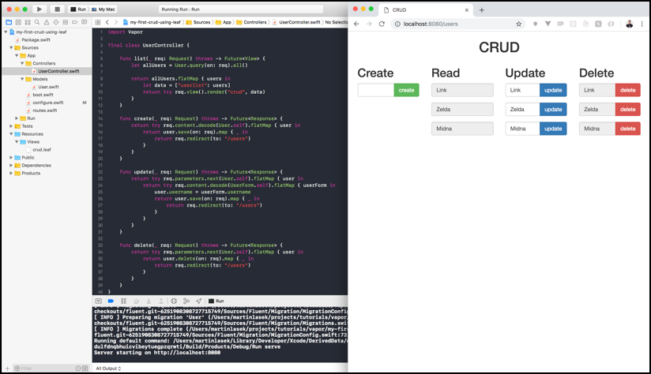

  <h2>My First CRUD using Leaf 👨🏼‍💻 </h2>
  <h3>Tutorial to build this project</h3>
  <h4><a href="">How to write CRUD using Leaf</a></h4>
   

  

## Community 🚀
Join the awesome and welcoming Vapor community in <a href="http://vapor.team/"><b>Slack!</b></a>
